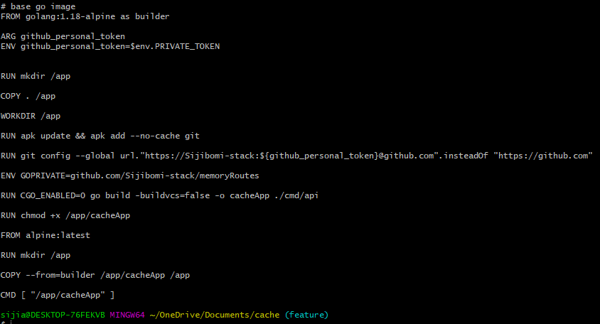
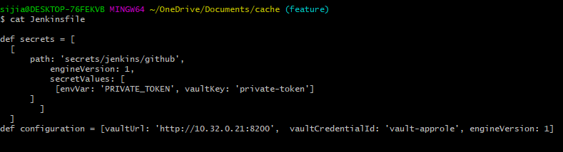

# embarkStudios
Embark Studios Test
[](http://192.168.56.4:32009/job/Memorycache-multipipeline/job/main/)

# In-Memory Cache

Simple in-memory cache with an HTTP interface built using Golang


## Authors

- [@Adesijibomi](https://github.com/Sijibomi-stack/embarkStudios.git)

## Documentation

[Documentation](https://linktodocumentation)

The scope of the project is to make a HTTP request to a fakestore json API and we will get a reponse according to the id that is provided in the key(id).
GET request for same id will return reponse from the Appcache which is the in-memory cache we built, and not from the fakestore json API.
The App is built as a golang module/package and is been called in the main.go file, this way we are able to separate the App logic from the main function itself. This way the App module can be updated with tags and can be used by multiple different functions.


## API Reference

#### Get an item

```http
  GET https://fakestoreapi.com/products/${id}
```

| Parameter | Type     | Description                |
| :-------- | :------- | :------------------------- |
| `api_key` | `int` | **Required**. Id of item to fetch |

```http
  POST https://post
```


## Integration & Deployment

The build environment is hosted on kubernetes provisioned by vagrant. This can be setup by running 
*vagrant up* in the dir where you have the files [@Sijibomi-stack/vagrant-files](https://github.com/Sijibomi-stack/VagrantFiles.git).
Check repo on how setup k8s using vagrant & virtual box.

```bash
  vagrant up
```
For this project we will be using **Dockerfile** to automate the build and **Jenkinsfile** for CICD pipeline, also we used **Hashicorp vault** to inject some private token into our pipeline, then we used prometheus to scrape the service endpoints and grafana for oberservability. We discuss each file and tools in details.

### Dockerfile


- From golang alpine (lightweight) as base image.
- Make an dir /app on the base image we created.
- Copy all files from the current folder to the /app folder.
- Set a working dir where we will run all stages.
- Download git using the apk package manager, this will be needed to download modules for our private modules.
- Set the git global config to use private token for authenticating the private repo module.
- Set Go environment variable to our private github repo.
- Build the app using go from the source dir cmd/api.
- Make the cacheapp executable by changing the permissions.
-  Build a smaller docker image from builder.

### Jenkinsfile


- Setting up the custom definitions to be used by the withVault plugin in the vault stage of the CICD pipeline. Here the Vault_ADDR, approle credentials and key value   store version used are set as environment variables.
