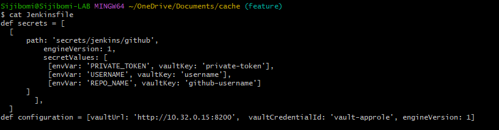

# MemoryCache
Memory cache Test
[](http://192.168.56.4:32009/job/Memorycache-multipipeline/job/main/)

# In-Memory Cache

Simple in-memory cache with an HTTP interface built using Golang


## Authors

- [@Adesijibomi](https://github.com/Sijibomi-stack/embarkStudios.git)

## Documentation

[Documentation](https://linktodocumentation)

The scope of the project is to make a HTTP request to a fakestore json API and we will get a reponse according to the id that is provided in the key(id).
GET request for same id will return reponse from the Appcache which is the in-memory cache we built, and not from the fakestore json API.
The App is built as a golang module/package and is been called in the main.go file, this way we are able to separate the App logic from the main function itself. This way the App module can be updated with tags and can be used by multiple different functions.


## API Reference

#### Get an item

```http
  GET http://fakestoreapi.com/products/${id}
```

| Parameter | Type     | Description                |
| :-------- | :------- | :------------------------- |
| `api_key` | `int` | **Required**. Id of item to fetch |

```http
  POST http://post
```

| Parameter | Type     | Description                |
| :-------- | :------- | :------------------------- |
| `api_key` | `/` | **Required**. keys for post |

### Memorycache module


- We declare package name as *memoryRoutes*, this will used as a module call in other functions.
- I used *fibre* package as my frame, because it's fast and *ttlcache* as to store application data.


- I can start by creating our struct which we'll name products, which will contain the following properties as shown above.
- This will be used to unmarshal our output to json


- I setup a check method *Checkcache* to check if the key of our API call has been used
- If it does we will return the data we have stored in the cache as Appcache. 
- But if the key doesn't exist in the Appcache, we will execute the next method *GetCache* which is a simple Get request to the fake placeholder we used.


### Main Module


- With this in place, we can then return to the main.go file and within our setupRoutes function we can map our endpoints to these new functions like so:
- We have now imported our new memoryRoutes package and mapped the endpoints we wanted to the GetCache, Checkcache and PostInCache functions.

## Integration & Deployment

The build environment is hosted on kubernetes provisioned by vagrant. This can be setup by running 
*vagrant up* in the dir where you have the files [@Sijibomi-stack/vagrant-files](https://github.com/Sijibomi-stack/VagrantFiles.git).
Check repo on how setup k8s using vagrant & virtual box.

```bash
  vagrant up
```
For this project we will be using **Dockerfile** to automate the build and **Jenkinsfile** for CICD pipeline, also we used **Hashicorp vault** to inject some private token into our pipeline, then we used prometheus to scrape the service endpoints and grafana for oberservability. We discuss each file and tools in details.

### Dockerfile


- From golang alpine (lightweight) as base image.
- Make an dir /app on the base image we created.
- Copy all files from the current folder to the /app folder.
- Set a working dir where we will run all stages.
- Download git using the apk package manager, this will be needed to download modules for our private modules.
- Set the git global config to use private token for authenticating the private repo module.
- Set Go environment variable to our private github repo.
- Build the app using go from the source dir cmd/api.
- Make the cacheapp executable by changing the permissions.
- Make a smaller docker image from builder.

### Jenkinsfile


- Setting up the custom definitions to be used by the withVault plugin in the vault stage of the CICD pipeline. 
- Here the Vault_ADDR, approle credentials and key value   store version used are set as environment variables.


- Here I used a multi-container yaml template to setup my continous integration, it is made up of two containers for git and kaniko.
- Kaniko is used because, Docker build containers run in privileged mode. It is a big security concern and it is kind of an open door to malicious attacks.
- Kubernetes removed Docker from its core. So, mounting docker.sock to host will not work in the future, unless you add a docker to all the Kubernetes Nodes.
- I have to create a kubernetes secret(dockercred) of type docker-registry for the kaniko pod to authenticate the Docker hub registry and push the image.


- Docker environment variables to login and push image to docker hub.


- Git checkout to main branch with the credential id of the private token for the github repo.


- I included this stage to test connection and $echo a secret, if this stage fails, connection to vault server needs to be checked.
- This can be done by exec into the jenkins pod and run **curl -H "X-Vault-Token: hvs.xxxxxxxxxxxxx"  http://10.32.0.24:8200/v1/secrets/jenkins/github | jq**


- This stage builds the project using the dockerfile with the execution steps, afterwards image is pushed to docker hub private repo.
- This is done using the Kaniko container as shown the kubernetes yaml.


- In this stage Deployment yaml is loaded into the workspace and this is done using the config file provider plugin


- Final continous deploymeny to kubernetes cluster is done here.
- First I use withkubeconfig plugin to connect to my local k8s cluster.
- I downloaded the kubectl utility and made it executable.
- Loaded the deployment yaml files
- Executed the kubectl creat -f, which will create all resources and services listed in the deployment file.

## Memorycache.yaml
